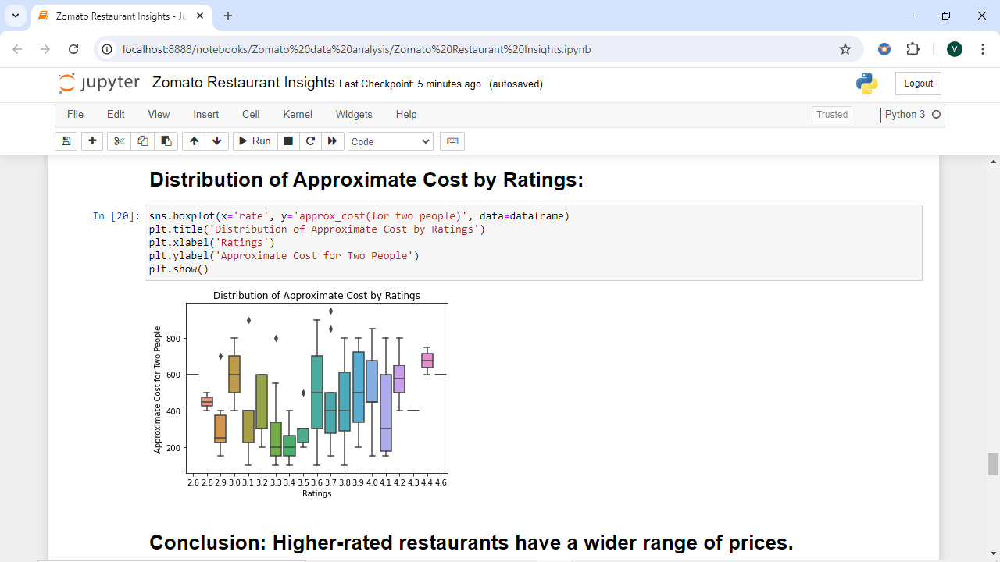
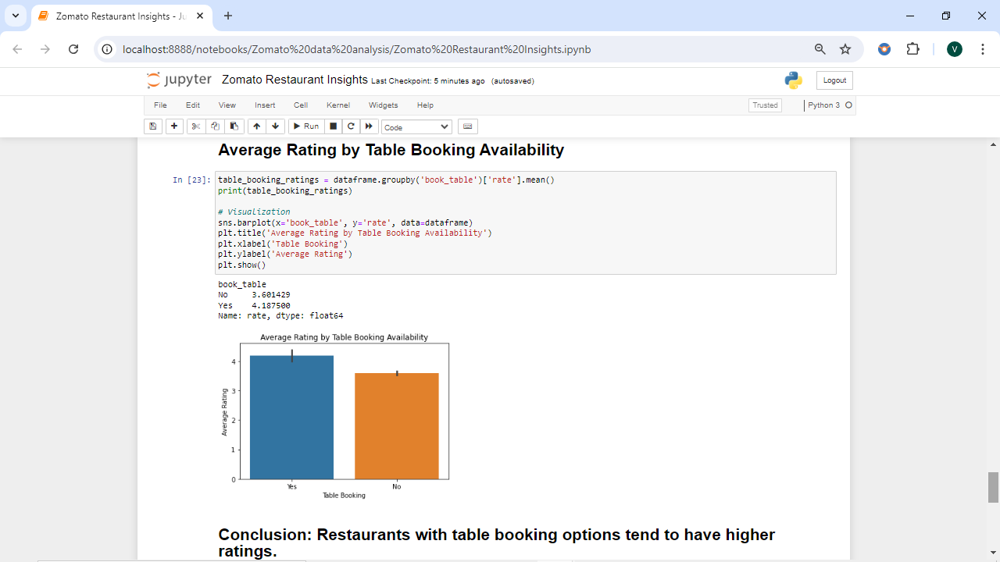
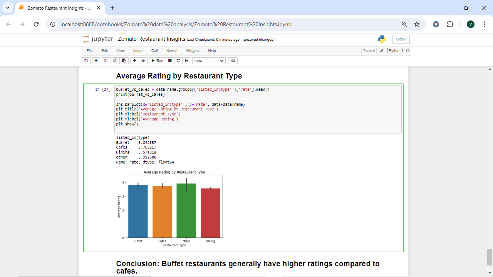

# Zomato Restaurant Insights: Analyzing Ratings, Costs, and Customer Preferences

## Overview
This project provides a comprehensive analysis of restaurant data from Zomato, focusing on customer ratings, cost distribution, online and offline order preferences, and the availability of table bookings. The goal is to uncover trends and insights that help understand the dining landscape on Zomato.

## Dataset
The dataset includes information about various restaurants, such as:
- **Online Order Availability**: Whether the restaurant accepts online orders.
- **Table Booking Options**: Whether the restaurant allows table bookings.
- **Customer Ratings**: The rating of the restaurant out of 5.
- **Number of Votes**: The number of customer reviews or votes the restaurant has received.
- **Approximate Cost for Two People**: The estimated cost for a meal for two people.
- **Restaurant Type**: The category under which the restaurant is listed (e.g., Buffet, Cafes).

## Key Visualizations

*Figure 1: Distribution of Approximate Cost by Ratings*

*Figure 2: Average Rating by Table Booking Availability*

*Figure 3: Average Rating by Restaurant Type*

## Key Findings and Conclusions
1. **Majority of Restaurants fall under the dining category.**
2. **Dining restaurants received maximum votes.**
3. **Most restaurants received ratings between 3.5 and 4.**
4. **The majority of couples prefer restaurants with an approximate cost of 300 rupees.**
5. **Offline orders received lower ratings in comparison to online orders.**
6. **Dining restaurants primarily accept offline orders, whereas cafes primarily receive online orders. This suggests that clients prefer in-person orders at restaurants but prefer online orders at cafes.**
7. **Higher-rated restaurants have a wider range of prices.**
8. **Restaurants with table booking options tend to have higher ratings.**
9. **Buffet restaurants generally have higher ratings compared to cafes.**

## Conclusion
This analysis highlights the key factors that influence restaurant ratings and customer preferences on Zomato. It provides insights into pricing, ordering preferences, and the impact of restaurant type on customer satisfaction.

## Future Work
Potential improvements include expanding the dataset, incorporating additional features, and applying machine learning models to predict restaurant success.

## Contributing
Feel free to fork this repository and submit pull requests. Contributions are welcome!
